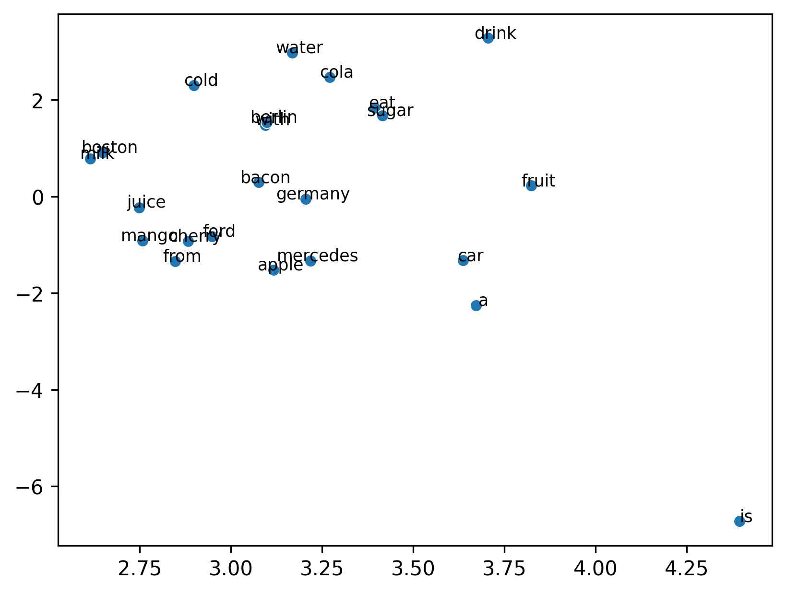
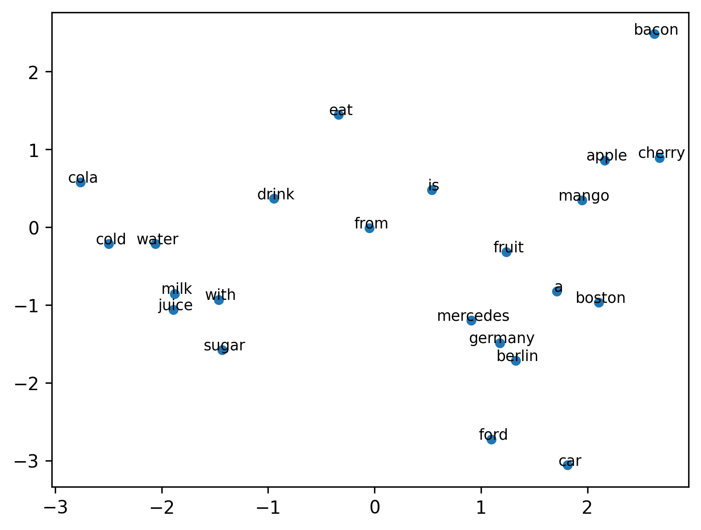

# From Distributional Hypothesis to Code: Implementing Skip-Gram

The **Distributional Hypothesis** simply states that *words that appear in the same context tend to have similar meanings* (Harris, 1954). This makes intuitive sense. For instance, if you say "I love **cat**," we associate "cat" with an entity capable of receiving affection. If we see another sentence like "I love **dog**," we can infer that "cat" and "dog" share semantic properties because they appear in similar contexts (e.g., as objects of affection). 

As the famous linguist J.R. Firth said: *"You shall know a word by the company it keeps."*

This simple theory lays the foundation for semantics in Natural Language Processing (NLP). Think of it like a recommendation algorithm on Instagram: if you search for "baby shoes," your feed adapts to show "strollers" or "cribs." The system learns that these items overlap in user interest. Similarly, Word2Vec learns to associate words by seeing them together in large datasets.

## 1. Traditional Methods vs. Predictive Embeddings

Before Word2Vec (developed by Google researchers in 2013), we often used **Co-Occurrence Matrices**. Imagine a giant table where rows are words and columns are the contexts they appear in. We count frequencies and use techniques like **Singular Value Decomposition (SVD)** to compress this information.

While effective, this approach has issues:
- **Sparseness/Size**: For a vocabulary of 100,000 words, you'd need a $100,000 \times 100,000$ matrix ($10$ billion cells!), mostly filled with zeros.
- **Computational Cost**: SVD is expensive ($O(mn^2)$) to update when new words are added.

**Predictive Embeddings (Word2Vec)** flipped the script. Instead of counting, we train a neural network to *predict* context words. We don't actually care about the prediction itself (it's a "fake" or "pretext" task); we care about the **weights** the network learns while trying to solve it. These weights become our word vectors.

## 2. The Architectures: CBOW vs. Skip-Gram

There are two main flavors of Word2Vec:

1.  **CBOW (Continuous Bag of Words):** The model sees the context (surrounding words) and tries to predict the center word.
    - *Example:* Input ["The", "quick", "fox"], Predict "brown".
2.  **Skip-Gram:** The model sees the center word and tries to predict the surrounding context words.
    - *Example:* Input "brown", Predict ["The", "quick", "fox"].

In this implementation and [Trainer](https://github.com/Black-fox17/llm_scratch/blob/main/embedding/skip-gram/trainer.py), we focus on **Skip-Gram**, which often performs better for rare words and smaller datasets.

### A. Distributional Objective (The Math)

Let:
- Vocabulary size: $V$
- Embedding dimension: $d$
- Input embedding matrix (Center words): $W_{in} \in \mathbb{R}^{V \times d}$
- Output embedding matrix (Context words): $W_{out} \in \mathbb{R}^{d \times V}$

Each word $w$ is represented by:
- Input vector $v_w = W_{in}[w]$
- Output vector $u_w = W_{out}[:, w]$

### B. Skip-Gram Objective

Given a center word $w_c$ and a context word $w_o$, Skip-Gram maximizes the probability of the context word given the center word:

$$
\log P(w_o \mid w_c)
$$

## 3. Training Methods

We implemented two ways to train this in [Trainer](https://github.com/Black-fox17/llm_scratch/blob/main/embedding/skip-gram/trainer.py).

### Method 1: Full Softmax (The "Correct" but Slow Way)

Theoretically, we define probability using the softmax function:

$$
P(w_o \mid w_c) = \frac{\exp(u_{w_o}^\top v_{w_c})}{\sum_{w=1}^{V} \exp(u_{w}^\top v_{w_c})}
$$

In code, this looks like calculating the dot product of the center word with *every other word in the dictionary* to compute the denominator.

**The Problem:** If $V = 100,000$, we do 100,000 computations for *every single training pair*. This is computationally infeasible for large vocabularies.

```python
# From trainer.py
# 2. Forward Pass
z1 = self.W_in[center]       # (Dim,)
z2 = z1 @ self.W_out         # (Vocab,) -> Dots with all context words

# 3. Compute Loss
log_softmax = F.log_softmax(z2, dim=0)
loss = F.nll_loss(log_softmax.view(1, -1), y_true)
```

### Method 2: Negative Sampling (The Efficient Approximation)

Instead of normalizing over all words, we reformulate the task as **Binary Classification**.
- **Positive pair:** $(w_c, w_o)$ (Real data) -> We want the model to output 1.
- **Negative pairs:** $(w_c, w_k)$ (Fake/Noise data) -> We want the model to output 0.

We sample $K$ negative words from a noise distribution $P_n(w)$. The new objective function ($L_{SGNS}$) maximizes the probability of the real pair and minimizes the probability of the random noise pairs:

$$
L_{SGNS} = \log \sigma(u_{w_o}^\top v_{w_c}) + \sum_{k=1}^{K} \log \sigma(-u_{w_k}^\top v_{w_c})
$$

Where $\sigma(x) = \frac{1}{1+e^{-x}}$ is the sigmoid function.

This is exactly what `train_negative_sampling` does in our code. We only update the weights for the positive word and the $K$ negative words (e.g., 5 words) instead of the entire 100,000 vocabulary.

```python
# From trainer.py - Positive Sample
score_pos = torch.sigmoid(v_c @ self.W_out[:, context])
loss_pos = -torch.log(score_pos + 1e-8)

# From trainer.py - Negative Sample
score_neg_correct = torch.sigmoid(-score_dot)
loss_neg = -torch.log(score_neg_correct + 1e-8)
```

### E. Unigram Noise Distribution

How do we pick the negative words? We don't just pick purely at random. We use a "smoothed" Unigram distribution:

$$
P_n(w) = \frac{f(w)^{0.75}}{\sum_{i=1}^{V} f(i)^{0.75}}
$$

This $0.75$ power dampens the effect of extremely frequent words (like "the", "is") so we don't just constantly sample them, while still sampling them more often than rare words.

### F. Comparing with CBOW (Appendix)

For completeness, if we were doing CBOW:
Given a context window $C = \{w_1, \dots, w_m\}$, we average their vectors:

$$
v_C = \frac{1}{m} \sum_{i=1}^{m} v_{w_i}
$$

And the loss looks very similar, just replacing the center vector with the averaged context vector:

$$
L_{CBOW} = \log \sigma(u_{w_c}^\top v_{C}) + \sum_{k=1}^{K} \log \sigma(-u_{w_k}^\top v_{C})
$$

## 4. Implementation Details [Trainer](https://github.com/Black-fox17/llm_scratch/blob/main/embedding/skip-gram/trainer.py)

In our `SkipGramTrainer` class:
1.  **`initialize_weights`**: Creates `W_in` and `W_out` as random matrices.
2.  **`train_full_softmax`**: Implements the expensive softmax loop (good for small tests/understanding).
3.  **`train_negative_sampling`**: Implements the optimized SGNS loss. 
    - It manually computes gradients for efficiency and updates `W_in[center]` and specific columns of `W_out`.
    - It uses `torch.multinomial` to sample from the unigram distribution we calculated.

## 5. Beyond Word2Vec: Modern Approaches

While Word2Vec was revolutionary, the field has moved forward to address its limitations.

### FastText: Subword Information
One major limitation of Word2Vec is that it treats every word as a unique atomic unit. "Apple" and "Apples" share no parameters. **FastText** (created by Facebook AI Research) improved this by representing words as bags of character n-grams.
- **Mechanism**: The vector for "apple" is the sum of vectors for "<ap", "app", "ppl", "ple", "le>", etc.
- **Benefit**: It can generate embeddings for *out-of-vocabulary* words (by summing their subword parts) and captures morphological relationships (like verb conjugations) much better.

### Transformers & LLMs: Contextual Embeddings
Word2Vec produces **static embeddings**: the word "bank" has the same vector in "river bank" and "bank deposit."

Modern LLMs (like BERT, GPT, and modern Gemini) use the **Transformer** architecture to create **contextualized embeddings**. 
- **Mechanism**: They use **Self-Attention** to look at the entire sentence at once, calculating how much every word relates to every other word in the sequence.
- **Benefit**: The vector for "bank" changes dynamically based on the surrounding context. "Bank" in a financial context looks different from "Bank" in a geographic context. This dynamic nature is why modern LLMs can understand nuance, sarcasm, and complex instructions in a way that static word vectors never could.

## Appendix: Visualizations

### Appendix A: Word Clustering Before Training


### Appendix B: Word Clustering After Training


**Thanks for reading!**

If you have any questions or suggestions, you can reach out to me via email at  
[Mail](mailto:ayeleru1234@gmail.com)